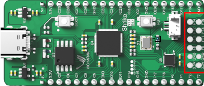

# ShrikeLite

ShrikeLite

| Name | Value |
| --- | --- |
| Family | SLG479 |
| Type | SLG47910V |
| Clock | 50.0 |
| Toolchain | greenpak |
| URL | [link](https://github.com/vicharak-in/shrike) |

## Slots
### PIN

| Name | Pin | Direction |
| --- | --- | --- |
| 5V_1 | 5V | all |
| 3V3_1 | 3V3 | all |
| IO29 | RP:IO29 | all |
| IO28 | RP:IO28 | all |
| IO27 | RP:IO27 | all |
| IO26 | RP:IO26 | all |
| GND_1 | GND | all |
| IO25 | RP:IO25 | all |
| IO24 | RP:IO24 | all |
| IO23 | RP:IO23 | all |
| IO22 | RP:IO22 | all |
| IO21 | RP:IO21 | all |
| GND_2 | GND | all |
| IO20 | RP:IO20 | all |
| IO19 | RP:IO19 | all |
| IO18 | RP:IO18 | all |
| IO17 | RP:IO17 | all |
| IO16 | RP:IO16 | all |
| GND_3 | GND | all |
| 5V_2 | 5V | all |
| 3V3_2 | 3V3 | all |
| IO5 | RP:IO5 | all |
| IO6 | RP:IO6 | all |
| IO7 | RP:IO7 | all |
| IO8 | RP:IO8 | all |
| IO9 | RP:IO9 | all |
| GND_4 | GND | all |
| IO10 | RP:IO10 | all |
| IO11 | RP:IO11 | all |
| IO14 | RP:IO14 | all |
| IO15 | RP:IO15 | all |
| GND_5 | GND | all |
| F17 | PIN_8 | all |
| F18 | PIN_9 | all |
| F0 | PIN_13 | all |
| F1 | PIN_14 | all |
| F2 | PIN_15 | all |
| F7 | PIN_20 | all |

### PMOD

| Name | Pin | Direction |
| --- | --- | --- |
| F14 | PIN_5 | all |
| F12 | PIN_3 | all |
| F10 | PIN_1 | all |
| F8 | PIN_23 | all |
| GND_1 | GND | all |
| 3V2_1 | 3V2 | all |
| F15 | PIN_6 | all |
| F13 | PIN_4 | all |
| F11 | PIN_2 | all |
| F9 | PIN_24 | all |
| GND_2 | GND | all |
| 3V2_2 | 3V2 | all |

### BLUE

| Name | Pin | Direction |
| --- | --- | --- |
| L1 | PIN_7 | all |

